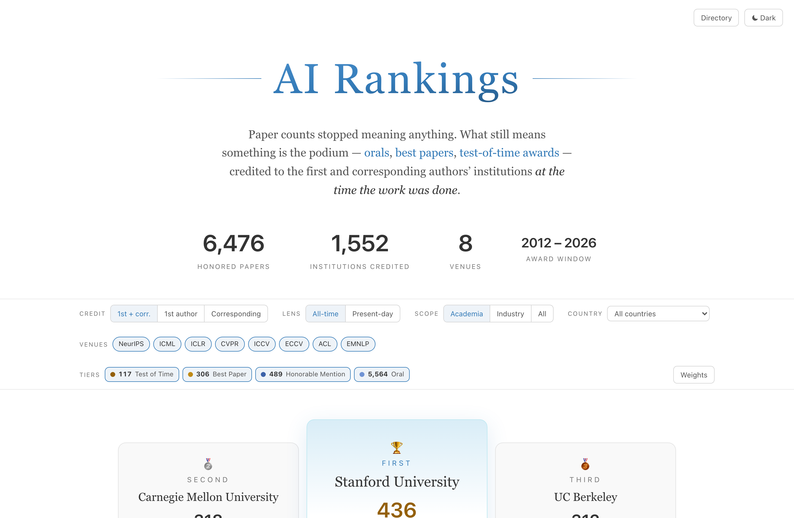

# AI Rankings

**English** | [简体中文](README.zh-CN.md)

> Only the podium counts.

**Live: [airankings.jingxuan.uk](https://airankings.jingxuan.uk)** · [Directory (CSRankings-style) view](https://airankings.jingxuan.uk/classic.html)

An awards-only ranking of AI institutions and people. Acceptance counts can be farmed —
more faculty, more submissions, more accepted papers, higher rank. What can't be farmed is
what the community itself singles out. This project counts **only** orals, best papers
(incl. outstanding papers), honorable mentions / official award candidates, and test-of-time
prizes at eight venues:

> NeurIPS · ICML · ICLR · CVPR · ICCV · ECCV · ACL · EMNLP

Regular acceptances score **zero, by design**.

## Methodology

**Who gets credit.** Each honored paper credits the **first author's** and the
**corresponding author's** institutions *as printed on the paper at publication time*
(50 / 50 split; full credit when they coincide; an author's multiple affiliations split
equally). Where no corresponding author is flagged, the last author stands in, per AI
convention. Middle authors do not score.

**Latency, modelled.** Every award event carries two timestamps: the year it was *granted*
(`year_awarded`) and the year the work was *done* (`year_work`). A test-of-time award won in
2024 for a 2014 paper credits the lab of 2014 — "Attention Is All You Need" belongs to the
Google of 2017, not to whoever employs its authors today. The **All-time** lens credits the
year of work at full value; the **Present-day** lens decays each event by the age of the work
with an adjustable half-life, so the ranking can answer "who is strong *now*" separately from
"who built the canon".

**Default weights** (adjustable live in the UI):

| Tier | Weight |
|---|---|
| Test of Time | 10 |
| Best / Outstanding Paper | 8 |
| Honorable Mention / Award Candidate | 3 |
| Oral | 1 |

**Everything is a live control**: attribution mode (first / corresponding / both), lens and
half-life, academia vs industry scope (academia is the default), country, venues, tiers and
weights all recompute the ranking client-side in real time. Institutions open into a dossier
with their people (linked to homepages), score history and full award record; the Directory
view mirrors CSRankings' classic expandable-table layout.

## Data

- **6,476 honored papers** (award window 2012 – mid-2026; test-of-time prizes reach back to
  work from 1987), 97.8 % affiliation-resolved — every test-of-time and virtually every
  best-paper–tier entry is resolved; the unresolved tail is ~130 pre-2017 CVPR/ECCV orals
  whose papers sit behind publisher paywalls with no open copy.
- Honors collected from official sources: OpenReview, conference award announcements,
  ACL Anthology, CVF Open Access — every entry carries a source URL. Venue-years where every
  accepted paper was presented orally (e.g. several mid-2010s ICML editions) are excluded
  from the oral tier, because an honor everyone receives is not an honor.
- Affiliations resolved through three stacked routes, best first:
  1. **OpenReview author profiles** — dated position histories give the institution
     *at the year of the work*;
  2. **Crossref** authorship records (IEEE deposits affiliations for CVPR/ICCV);
  3. **PDF first pages** — batch-extracted and spot-checked; all test-of-time and
     best-paper–tier entries were individually verified by hand.
- Institution names are canonicalized across sources (diacritic folding, alias table,
  campus disambiguation).

**Known caveats.** The last-author-as-corresponding convention is an approximation; a small
tail of institutions with unresolved countries is grouped as "Unknown". TPAMI is deliberately
absent (journals have no oral/best-paper mechanism; the PAMI community's test-of-time prize —
the Longuet-Higgins — is awarded at CVPR, which is covered). AAAI/IJCAI are excluded for low
signal density.

## Acknowledgements & license

Rankings are compiled from publicly announced conference honors. Award decisions belong to
the respective conferences and program committees; affiliation records draw on OpenReview,
Crossref and the papers themselves. This project is not affiliated with any conference, with
CSRankings (whose classic layout the Directory view pays homage to), or with any ranked
institution.

Code: [MIT](LICENSE). Compiled dataset (`site/data.json`): CC BY 4.0 — cite this repository
if you use it.
